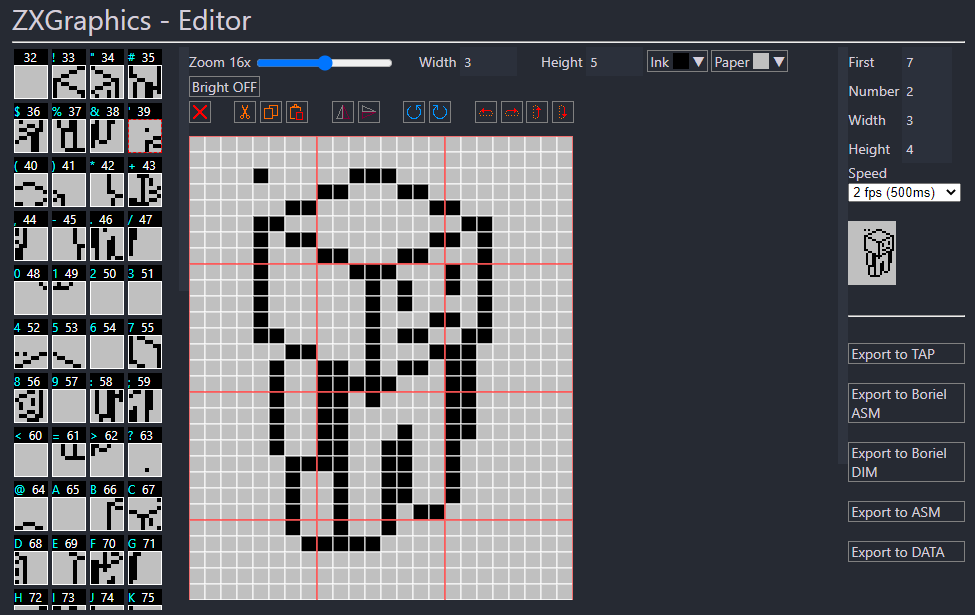

# ZX Graphics Editor by DuefectuCorp

Tool for edit GDUs and Fonts for ZX Spectrum 48K/128K. With this editor you can create custom UDGs and fonts.

The editor can handle files with the following extensions:

- `.udg`: (User Defined Graphics) It's an array of 168 bytes (21 characters x 8 lines each one) with the raw definition of this UDGs.
- `.gdu`: From the spanish "Graficos Definidos por el Usuario", it's the same than `.udg` 
- `.fnt`: Personalized font. And array of 768 bytes (96 characters x 8 lines each one) width the raw definition of the alternate charset.

In addition to allowing editing of these file types, data can be exported in `.tap` format for loading from an emulator (thanks to the export routine that has been developed by Hash6iron) or `.bas`, a format specifically designed for use in ZX Boriel Basic.

We are working on expanding functionalities and we would like to hear your opinion.

## How to start
Create a new empty file with the extenson .gdu, .udg or .fnt in the VSCode file explorer and open it.

## Help & suggestions
- Twitter: [@Duefectu](https://twitter.com/duefectu)
- Mail: duefectucorp@gmail.com

## More from DuefectuCorp
- `Projects for ZX Spectrum`: https://zx.duefectucorp.com/
- `General info`: http://duefectucorp.com/
- `CuadragonNext`: A game for ZX Spectrum Next https://cuadragonnext.duefectucorp.com/

## Credits and acknowledgements
- `Idea, test and development`:  Duefectu ([@Duefectu](https://twitter.com/duefectu) - duefectucorp@gmail.com)
- `TAP export routine`: Hash6iron ([@hash6iron](https://twitter.com/hash6iron) - hash6iron@gmail.com)
- `Boriel ZX Basic`: https://zxbasic.readthedocs.io/en/latest/

## Suport me
- `Patreon`: https://www.patreon.com/DuefectuCorp
- `PayPal`: [Donate](https://www.paypal.com/donate/?business=P379443S9HQKW&no_recurring=0&item_name=Support+ZX+DuefectuCorp&currency_code=EUR)

## Licence
- © 2022 DuefectuCorp
- `MIT License`: https://en.wikipedia.org/wiki/MIT_License

## Versions
### v0.0.4
- Restored minumun version of VSCode to 1.65.0
### v0.0.3
- Added mirror buttons
- Added rotation buttons
- Added shift buttons
- Minimum version set to 1.50.0 or newer
- Hash6iron mail fixed in Readme.md file
### v0.0.2
- Open new empty files now offers to load default data
- Renamed option for export "Boriel" to "Boriel ASM"
- Added option for export to "Boriel DIM" format
### v0.0.1
- Initial version
